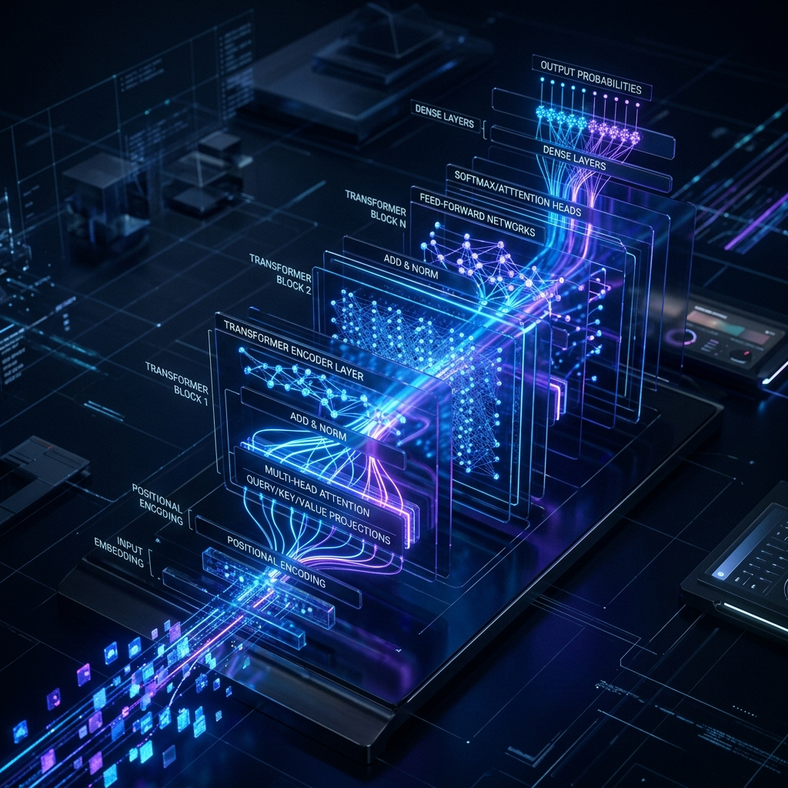
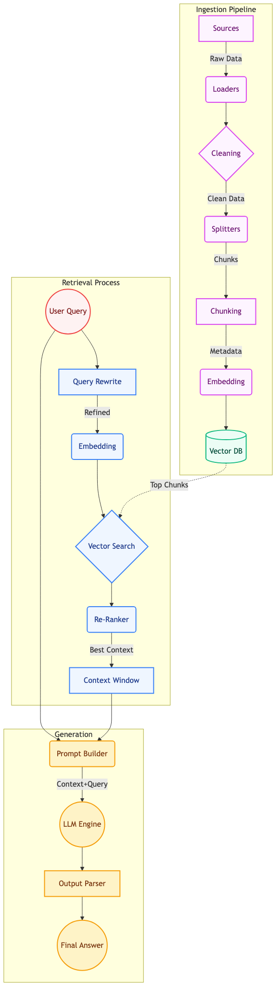
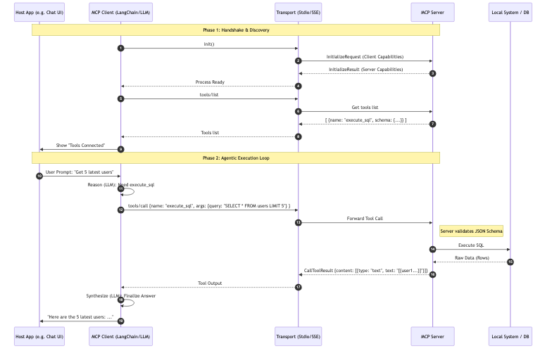

# Master Technical Guide: Modern AI Architectures (RAG & MCP)

This master guide compiles fundamental AI concepts, deep-dive architectural methodologies (RAG & MCP), orchestration via LangChain, and production roadmaps into a single comprehensive handbook.

---

## 🇻🇳 Phiên bản Tiếng Việt

### 1. Kiến thức Tổng quát & Thuật ngữ AI Bản lề
Trong kỷ nguyên ứng dụng AI hiện đại, chúng ta chuyển dịch từ các "Chatbot" đơn thuần sang các **AI Agents** (Tác nhân AI) - những hệ thống có thể tự suy luận và thực thi. 
*   **LLM (Large Language Model):** Bộ não xử lý ngôn ngữ (Gemini, GPT-4, Llama).
*   **Embedding (Nhúng):** Kỹ thuật chuyển đổi từ ngữ/câu thành các mảng số học (Vector) trong không gian đa chiều, giúp máy tính tính toán "ý nghĩa" tương đồng.
*   **Vector Database:** CSDL chuyên dụng để lưu và tìm các Vector này rất nhanh.
*   **Prompt Engineering:** Kỹ thuật thiết kế câu lệnh có cấu trúc (Context, Instruction, Tone) để LLM trả về kết quả chuẩn nhất.
*   **Agentic AI:** Hệ thống AI tự lập, sử dụng vòng lặp suy nghĩ và hành động để tự chọn công cụ giải quyết vấn đề.

---

### 2. Kiến trúc Chuyên sâu RAG (Retrieval-Augmented Generation)
RAG là kỹ thuật đưa "bộ nhớ ngoài" (dữ liệu doanh nghiệp) vào LLM để tránh ảo giác (Hallucination).

#### 2.1 Sơ đồ RAG cấp độ Production

#### 2.2 Các Thành Phần Nguyên Tử Quan Trọng nhất:
*   **Chunking (Cắt chia văn bản):** Dùng cơ chế chồng lấp (Overlap) để các đoạn văn không bị mất mạch ý nghĩa. Tốt nhất là Semantic Chunking (cắt theo luận điểm).
*   **Query Expansion:** Dùng một AI nhỏ viết lại câu hỏi cộc lốc của người dùng thành một câu đầy đủ ngữ cảnh trước khi ném vào CSDL tìm kiếm.
*   **Cross-Encoder Re-Ranking:** Bí quyết của RAG xịn. Vector Search chỉ tìm thứ "nhang nhác giống", mô hình Rerank sẽ trực tiếp chấm điểm độ liên quan tuyệt đối và chỉ giữ lại 3 đoạn đắt giá nhất.

#### 2.3 [Dữ liệu thêm vào] Chuyên sâu về Thuật toán Retrieval
*   **Bi-Encoders vs Cross-Encoders:** Bi-Encoders (như `text-embedding-3-small`) mã hóa query và doc riêng biệt -> Nhanh, dùng để vớt Top-50. Cross-Encoders nạp cả Query và Doc vào cùng một lượt xử lý -> Chậm nhưng cực kỳ chính xác để lọc ra Top-3.
*   **Cosine Similarity:** Công thức toán học đo góc giữa hai vector. Góc càng nhỏ (Similarity tiến về 1), ý nghĩa càng gần nhau.

---

### 3. Kiến trúc Chuyên sâu MCP (Model Context Protocol)
MCP chuẩn hóa giao thức giúp AI biết cách gọi hàm, đọc DB, hay thao tác tài nguyên hệ thống một cách an toàn nhất.

#### 3.1 Sơ đồ Giao thức Bắt tay và Thực thi

#### 3.2 Tầm quan trọng cốt lõi:
*   **Security Validation:** Phải chặn ngay từ cửa nếu LLM gọi sai kiểu biến số (JSON Schema) hoặc sinh ra câu lệnh nguy hiểm (chỉ cho phép SELECT). Server là nơi độc quyền chạy code.
*   **Tool Descriptions:** Viết mô tả JSON của hàm càng chi tiết, khả năng LLM luận ra lúc nào cần gọi hàm lúc nào không càng chính xác.

#### 3.4 [Dữ liệu thêm vào] Chi tiết Kỹ thuật Giao thức MCP
*   **Handshake JSON:** Khi khởi tạo, Server gửi `capabilities` xác định nó có bao nhiêu Tools, Resources, và Prompts. Client phản hồi với `clientInfo` (Model nào, Context window bao nhiêu).
*   **Tool Execution Context:** Khi gọi Tool, Server không chỉ chạy hàm mà còn đính kèm các "Progress updates" để UI hiển thị trạng thái đang xử lý (Streaming progress).

#### 3.3 Phân Tách Cấu Trúc Nội Bộ Của MCP (Deep-dive Components)
MCP không chỉ có `Tools` (Công cụ). Nó là một hệ sinh thái gồm 3 khối kiến trúc chính để quản lý Context của AI:

*   **1. Transports (Lớp Giao vận):**
    *   **Stdio (Standard I/O):** Thường dùng khi Client và Server cùng chạy trên một máy tĩnh. Giao tiếp qua luồng pipe của shell (rất an toàn, tốc độ chớp nhoáng).
    *   **SSE (Server-Sent Events) over HTTP:** Dùng khi Client (như Chat UI) là web app và Server là một API độc lập. Cho phép kết nối giữ nguyên (keep-alive) để gửi dữ liệu liên tục.
*   **2. Tools (Hành động - Actions):**
    *   Là các hàm (functions) cho phép LLM "thực thi" quyền lên hệ thống thật (ví dụ: `gửi_email()`, `chạy_lệnh_bash()`).
    *   Bắt buộc bảo vệ bởi `JSON Schema Validation` để chống LLM điền sai kiểu tham số.
*   **3. Resources (Tài nguyên - Read-only Context):**
    *   Là các dữ liệu tĩnh hoặc URI (ví dụ nội dung file `logs/app.log` hoặc bảng `users`).
    *   Khác với Tool (phải gọi bằng tham số), Resource nằm sẵn ở đó, AI có thể chỉ định đọc (Read) bất cứ lúc nào để tăng cường trí nhớ mà không sợ gây hậu quả hỏng hóc hệ thống.
*   **4. Prompts (Mẫu Gợi ý):**
    *   Server có thể cung cấp sẵn các thẻ UI (Prompts). Ví dụ khi người dùng bấm vào nút "Phân tích file Log", Server tự động bơm một Prompt Template bí mật gửi cho Client LLM để nó biết phải phân tích theo form nào.

---

### 4. Framework Điều phối: LangChain
LangChain (hoặc LlamaIndex) là "chất keo" liên kết mọi thứ lại thành ứng dụng.
*   **LCEL (LangChain Expression Language):** Viết mã gọn bằng đường ống (`Prompt | LLM | OutputParser`).
*   **ReAct Loop (Reason & Act):** Cách Agent hoạt động bằng vòng lặp:
    1.  **Thought:** Tôi cần làm gì tiếp?
    2.  **Action:** Tôi sẽ gọi Tool X với tham số Y.
    3.  **Observation:** Lấy dữ liệu công cụ trả về. (Chưa xong thì quay lại Thought).

---

### 5. Yêu cầu Nền tảng (Prerequisites)
Để triển khai thực tế, bạn cần các mảng kỹ năng sau:
1.  **Ngôn ngữ lập trình:** Python (Mạnh về Data/AI Logic), TypeScript (Mạnh về API/Frontend/MCP Client).
2.  **DevOps:** Docker, Docker Compose (Cô lập môi trường chạy an toàn).
3.  **Hạ tầng:** Vector DB (FAISS cho local nhỏ; Pinecone/Chroma cho hệ thống lớn).

---
---

## 🇺🇸 English Version

### 1. General Knowledge & AI Terminology
In the modern AI era, we transition from simple "Chatbots" to autonomous **AI Agents**.
*   **LLM (Large Language Model):** The reasoning engine (Gemini, GPT-4).
*   **Embedding:** Transforming semantic concepts into multi-dimensional arrays (Vectors) for mathematical similarity comparison.
*   **Vector Database:** Purpose-built, blazing-fast databases for storing and searching vectors.
*   **Prompt Engineering:** The structural design of instructions (Context, Instruction, Tone) to guarantee precision.
*   **Agentic AI:** Autonomous systems utilizing a reasoning & acting loop to dynamically use tools.

---

### 2. Advanced RAG Architecture
RAG introduces an "external memory" (your enterprise data) to the LLM to eliminate hallucinations.

*(Please refer to the detailed production RAG Mermaid flowchart in the Vietnamese section).*

#### 2.1 Essential Atomic Components:
*   **Chunking Strategy:** Employing overlapping to preserve context bounds. **Semantic Chunking** (breaking at logical conclusion points) is optimal.
*   **Query Expansion:** Using a smaller, ultra-fast LLM to rewrite and expand a user's short, ambiguous query before the vector search for vastly improved hits.
*   **Cross-Encoder Re-Ranking:** The secret sauce for precision. Standard searches simply find "nearest neighbors". A Re-ranker applies deep semantic judgment to select only the absolute most relevant chunks to feed the LLM.

---

### 3. Advanced MCP Architecture (Model Context Protocol)
MCP creates a standardized, safe protocol for AI to request function executions, DB reads, or local resources.

*(Please refer to the detailed Handshake & Execution sequence diagram in the Vietnamese section).*

#### 3.1 Core Principles:
*   **Security & Schema Validation:** You must barricade the execution layer. The MCP Server rigorously checks LLM hallucinated parameters against a strict JSON Schema before executing *any* code.
*   **High-Fidelity Tool Descriptions:** The LLM's only reference on when and how to invoke a tool is the metadata description. Writing highly descriptive tool schemas is more important than the actual backend function logic.

#### 3.2 Granular Breakdown of Internal MCP Components
MCP is not merely a "Tools" API. It is an entire ecosystem designed to feed context to an LLM securely. It possesses four core architectural pillars:

*   **1. Transports (The Communication Layer):**
    *   **Stdio (Standard I/O):** The default for local-first setups. The Client and Server communicate via shell standard input/output pipes. It is lightning-fast and extremely secure since nothing touches a network port.
    *   **SSE (Server-Sent Events) over HTTP:** The cloud layout. Ideal when the AI Client is a frontend chat UI and the Server is an isolated microservice. It uses keep-alive HTTP connections to stream tooling requests and responses.
*   **2. Tools (Executable Actions):**
    *   Functions that allow the LLM to actively modify or query the outside world (e.g., `execute_sql()`, `git_commit()`).
    *   Requires strict bounding via `JSON Schema Validation` to intercept LLM hallucinated parameters.
*   **3. Resources (Read-Only Context):**
    *   File URIs or static data points available on the Server (e.g., `file:///logs/nginx/error.log`).
    *   Unlike Tools which require parameter arguments, Resources are passive. The AI can subscribe to or read these resources safely to augment its context window without the risk of accidentally executing a destructive action.
*   **4. Prompts (Guided Templates):**
    *   The Server can offer predefined UI trigger cards ("Prompts"). For instance, clicking a "Debug App" button fetches a hidden prompt template from the MCP server, injecting precise debugging instructions directly into the LLM context.

---

### 4. Orchestration Framework: LangChain
LangChain operates as the essential orchestration layer binding the AI to its memory and tools.
*   **LCEL:** Declarative paradigm utilizing a Unix-style piping structure (`Prompt | LLM | Parser`).
*   **ReAct Loop (Reason & Act):** The fundamental loop of Agentic autonomy:
    1.  **Thought:** Analyzing the current state.
    2.  **Action:** Selecting Tool X with parameter Y.
    3.  **Observation:** Receiving tool output (If goal is unmet, loop restarts).

---

### 5. Deployment Prerequisites
For a production stack, the following disciplines are required:
1.  **Languages:** Python (For core Data pipelines and Agentic reasoning) and TypeScript (Ideal for building fast APIs and Client MCP implementations).
2.  **DevOps Architecture:** Docker & Compose files for deterministic, isolated deployments.
3.  **Infrastructure Tooling:** Local Vector stores like FAISS or managed scaled instances like Pinecone/Chroma.

---

> [!TIP]
> **Summary for Architects:** A high-quality Agentic system depends 80% on clean Data Ingestion/Re-ranking (RAG) and strict Schema Validation (MCP), and only 20% on the inherent smartness of the base LLM. Focus heavily on your engineering layers!
